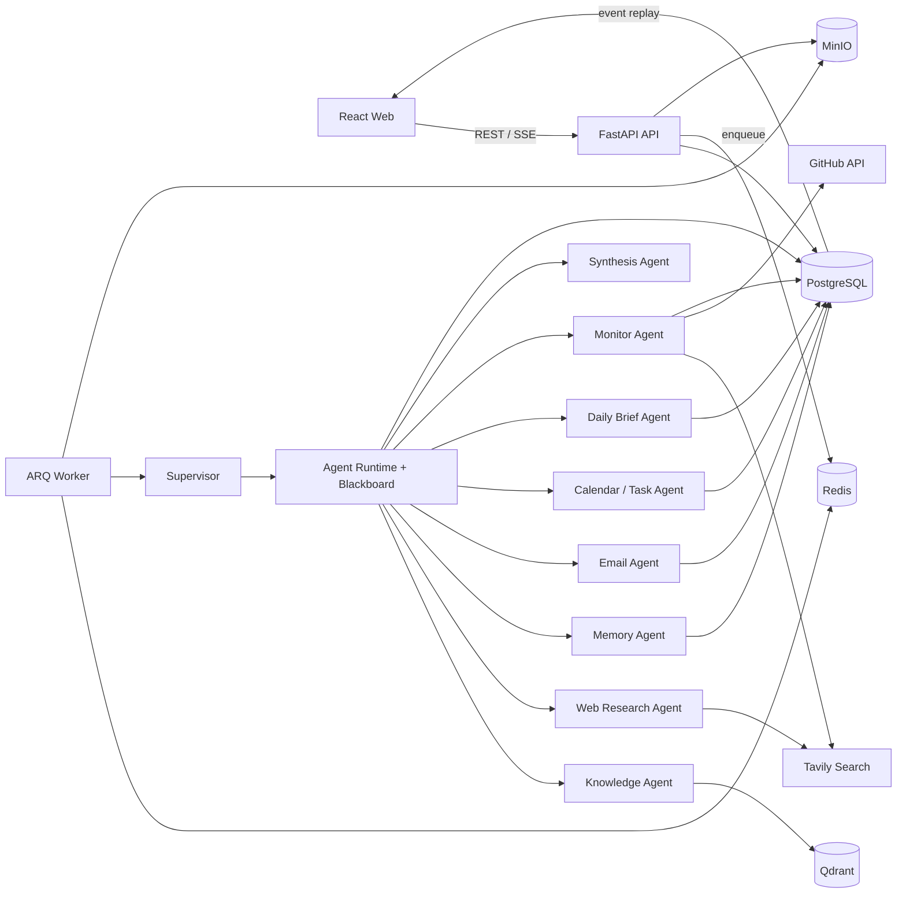

# PMAA Web

PMAA Web 是个人多智能体助手的前后端重构版，与原 Streamlit 项目完全独立。项目采用 React 工作台、FastAPI API、后台任务队列和 LangGraph Agent Runtime，目标是形成可部署、可观测、可扩展的生产化系统。

## 已实现能力

- React + TypeScript + Vite 三栏工作台，使用 TanStack Query 管理服务端状态
- 账号注册、登录、JWT Access/Refresh Token 轮换与按用户数据隔离
- 任务中心：运行状态筛选、分页、取消、失败重试和历史任务跳转
- FastAPI REST API 与可断线回放的 SSE 执行事件
- Supervisor 路由、统一 AgentTask/AgentMessage/AgentResult 协议与中央 Blackboard
- Agent Registry 工具白名单、Runtime 依赖调度、并发执行、超时与失败重试
- Web Research Agent 独立 LangGraph：查询规划、并行搜索、证据评估、补搜与引用汇总
- Memory Agent 独立 LangGraph：相关记忆检索，以及候选提取、确定性验证、去重更新
- Email Agent 独立 LangGraph：IMAP 只读获取、优先级筛选、摘要与回复草稿；SMTP 发送必须确认
- Calendar / Task Agent 独立 LangGraph：日程待办查询、冲突检查与 pending 动作规划
- Daily Brief Agent 独立 LangGraph：并行聚合邮件、日程、记忆与主题新闻，评估优先级并生成简报
- Monitor Agent 独立 LangGraph：采集 GitHub/新闻/公司/博客快照，建立基线、检测新增变化并生成未读通知
- Synthesis Agent 独立 LangGraph：对多 Agent 证据去重、冲突标注、置信度评估与最终汇总
- PostgreSQL 保存任务、事件、知识文档和文本块
- Redis + ARQ 执行文档索引和 Agent 长任务
- MinIO 保存 PDF、DOCX、Markdown、TXT 原始文件
- LangGraph Agentic RAG：查询分析、检索、证据评分、补充检索、引用回答
- BM25 中文词法检索；配置 Embedding 后自动启用 Qdrant 向量检索与 RRF 融合
- 可选 OpenAI-compatible LLM；未配置时使用可验证的抽取式证据回答
- Alembic 数据库迁移与 Docker Compose 一键启动

## 架构



浏览器 SSE 负责展示任务状态；MCP Streamable HTTP 是 Agent Runtime 接入外部工具的协议，两者属于不同边界。

## 快速启动

```powershell
cd E:\langgraph_projects\agent-assistant-web
Copy-Item .env.example .env
# 生产环境必须替换为足够长的随机密钥
$env:JWT_SECRET_KEY = "replace-with-a-long-random-secret"
docker compose up -d --build
```

访问地址：

- Web：`http://127.0.0.1:5173`
- API 文档：`http://127.0.0.1:8000/docs`
- MinIO 控制台：`http://127.0.0.1:9001`

首次进入后，在左侧打开“知识库”，上传资料并等待状态变为“可检索”；然后回到对话页，选择 `Agentic RAG` 提问。

Docker Compose 默认启用认证，首次访问先注册账号。直接本地开发时可在 `.env` 设置
`AUTH_ENABLED=false` 使用固定开发用户；生产环境必须设置为 `true`，且不可使用示例 JWT 密钥。

长任务默认进入 ARQ 队列。刷新页面或切换模块不会中断任务，可在“任务中心”查看进度、
取消尚未完成的任务，或重试失败任务。创建任务使用 `Idempotency-Key` 防止重复提交。

## 模型配置

复制 `.env.example` 为 `.env`。默认使用 DeepSeek 生成回答，并通过 FastEmbed
在本机以 CPU 运行中文向量模型：

```dotenv
LLM_BASE_URL=https://api.deepseek.com
LLM_API_KEY=
LLM_MODEL=deepseek-v4-flash

EMBEDDING_PROVIDER=fastembed
EMBEDDING_MODEL=BAAI/bge-small-zh-v1.5
EMBEDDING_DIMENSIONS=512
EMBEDDING_BASE_URL=
EMBEDDING_API_KEY=
```

`fastembed` 模式不需要 Embedding API Key，首次入库或检索时会下载约 90 MB 的
ONNX 模型，之后复用 Docker 缓存。若切换到 OpenAI-compatible Embedding 服务，
将 `EMBEDDING_PROVIDER` 改为 `openai_compatible`，并填写 Base URL、API Key、模型名
和真实向量维度。

`.env.example` 还预留了 Tavily、QQ 邮箱、GitHub Monitor、任务调度、飞书日历和
JWT 配置。启用 Web Research Agent 时需配置：

```dotenv
WEB_SEARCH_PROVIDER=tavily
TAVILY_API_KEY=
TAVILY_MAX_RESULTS=5
WEB_RESEARCH_MAX_ROUNDS=2
WEB_RESEARCH_MAX_QUERIES=3
```

未配置 Embedding 时使用 BM25；未配置 LLM 时返回带引用的检索证据，不会伪造回答。

## 质量检查

```powershell
uv sync --all-extras
uv run ruff check backend/src backend/tests
uv run pytest
cd frontend
npm ci
npm run build
```

详细设计见 [架构文档](docs/ARCHITECTURE_ZH.md)。
