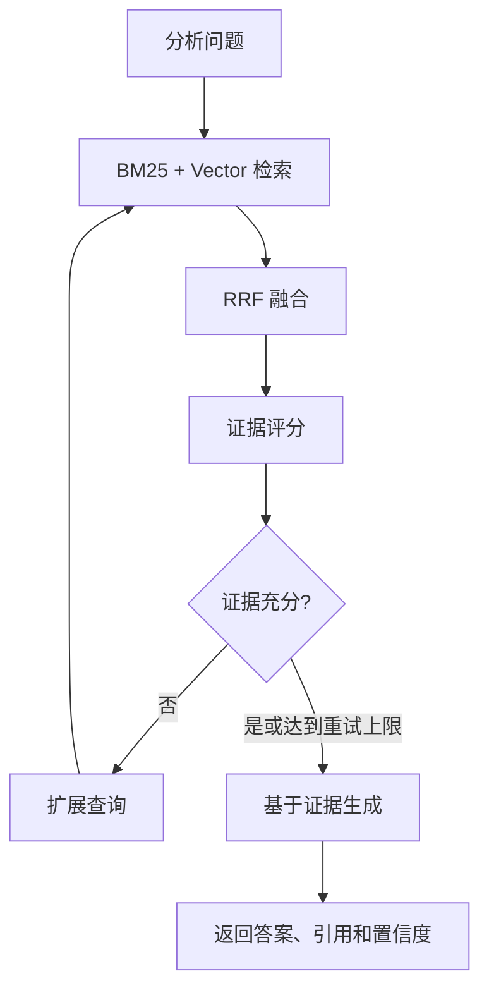
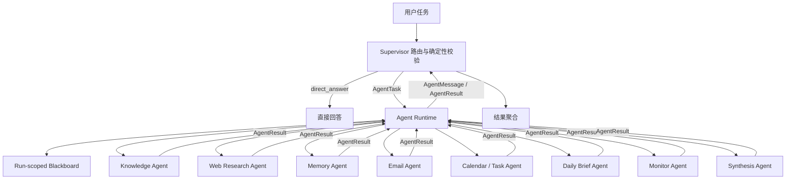
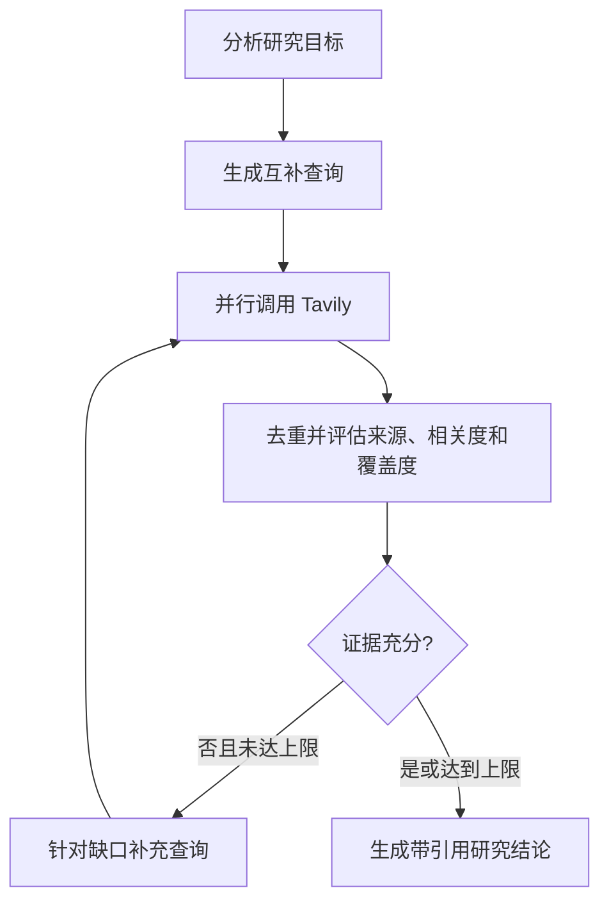
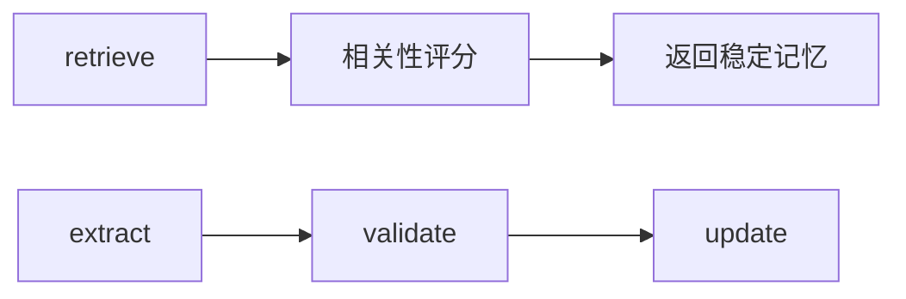
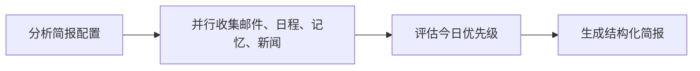
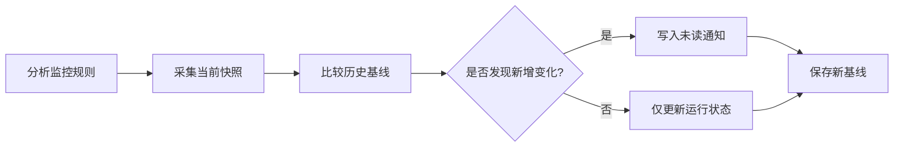

# PMAA Web 架构设计

## 1. 设计目标

PMAA Web 将 UI、API、后台任务、Agent Runtime、业务数据和检索基础设施拆分。页面刷新或切换不终止任务，API 与 Worker 可独立扩容，任务状态可以持久化和回放。

## 2. 分层职责

| 层 | 技术 | 主要职责 |
|---|---|---|
| Web UI | React、TypeScript、Vite、TanStack Query | 任务输入、知识管理、状态展示、SSE 订阅 |
| API | FastAPI | JWT 认证、参数校验、资源所有权、任务创建、查询和上传接口 |
| Background Jobs | Redis、ARQ | 长任务排队、Worker 执行和横向扩展 |
| Supervisor | 结构化路由、确定性校验 | 判断直接回答或委派专业 Agent |
| Agent Runtime | AgentTask、DAG、Blackboard | 注册、依赖调度、并发、重试、消息与结果聚合 |
| 子 Agent | LangGraph | 独立目标、局部状态、工具选择与执行闭环 |
| Business Data | PostgreSQL | 任务、事件、知识文档、文本块与审计事实 |
| Retrieval | BM25、Qdrant、RRF | 词法检索、向量检索与结果融合 |
| Object Storage | MinIO | 原始文档持久化 |

## 3. 文档入库流程

1. React 调用 `POST /api/v1/knowledge/documents` 上传文件。
2. FastAPI 校验扩展名、大小和所有权，将原始文件写入 MinIO。
3. API 在 PostgreSQL 创建 `knowledge_documents` 记录，并向 ARQ 投递索引任务。
4. Worker 解析 PDF、DOCX、Markdown 或 TXT，并按自然边界和重叠窗口切分。
5. 文本块写入 PostgreSQL，作为可审计的词法检索来源。
6. 若配置 Embedding，Worker 同时将向量与元数据写入 Qdrant。
7. 文档状态更新为 `indexed`；失败原因写入 `error`，前端轮询展示。

## 4. Agentic RAG 执行流程

LangGraph 每个节点完成后写入 `run_events`，因此前端看到的是实际执行节点，不是模拟进度。

## 5. 多 Agent 通信与调度

第一版采用中心化通信。子 Agent 之间不能直接调用，所有任务和结果都经过 Supervisor：

- `AgentTask`：目标、负责人、依赖、上下文摘要、超时和最大尝试次数。
- `AgentMessage`：Supervisor 与子 Agent 之间的委派、状态和结果消息。
- `AgentResult`：状态、结构化输出、证据、置信度、错误和指标。
- `AgentRegistry`：维护能力目录与工具白名单，拒绝委派给未注册 Agent。
- `Blackboard`：保存本次 Run 的任务、消息、依赖结果和共享状态；`asyncio.Lock`
  保证并发访问安全。
- `AgentRuntime`：按依赖寻找就绪任务，同一层任务通过 `asyncio.gather` 并发执行，
  失败任务按策略重试，其下游任务标记为 blocked。
- `Synthesis Agent`：在多个专业 Agent 返回后读取依赖结果，执行证据去重、冲突标注、
  置信度评估和最终合成，不让 Supervisor 同时承担路由与内容创作。

Blackboard 是运行期协调状态，PostgreSQL `run_events` 是可回放的持久化审计事实。

## 6. Web Research Agent 工作流

该 Agent 拥有独立提示词、局部 LangGraph 状态和 `web_search` 工具白名单，返回标准
`AgentResult`，不是 Supervisor 内的一次普通工具调用。

## 7. 事件与一致性

- PostgreSQL 是事实来源，任务结果与事件不依赖 Redis 的持久性。
- `agent_runs.next_event_sequence` 通过原子 `UPDATE ... RETURNING` 分配事件序号，避免并发写入产生重复序号。
- SSE 根据事件序号增量读取 PostgreSQL，并支持 `Last-Event-ID` 断线续传。
- Redis 用于 ARQ 任务队列和实时发布，不承担最终业务事实。
- API 为运行记录保存幂等键；重复提交相同用户与幂等键时返回同一 Run。
- 取消操作写入 `cancel_requested_at`，Worker 在阶段边界协作式终止；失败任务由 ARQ
  指数退避重试，人工重试会创建带 `retry_of_run_id` 的新 Run，保留完整审计链。

## 8. 身份认证与数据隔离

- 用户密码使用 `scrypt` 加盐哈希，不保存明文密码。
- Access Token 使用短有效期 JWT；Refresh Token 只以摘要形式持久化并在刷新时轮换。
- API 从认证上下文获取 `user_id`，运行、会话、文档、记忆、邮件和自动化资源均按用户过滤。
- SSE 仅允许 GET 请求通过查询参数携带短期 Access Token，以兼容浏览器原生 `EventSource`。
- 开发环境可关闭认证；生产环境启动时会校验认证必须启用且 JWT 密钥不可使用默认值。

## 9. 降级策略

- Embedding 不可用：继续使用 PostgreSQL 中的 BM25 词法检索。
- Qdrant 暂时不可用：文档仍可完成词法索引，并在元数据记录告警。
- LLM 未配置：返回抽取式证据摘要和引用，不生成无依据内容。
- Redis 发布异常：SSE 仍可从 PostgreSQL 回放已提交事件。
- Supervisor LLM 路由异常：执行确定性降级规则，并再次校验 Agent 是否已注册。
- Tavily 未配置：Web Research 明确失败，不使用伪造来源或静态占位结果。

## 10. Memory Agent 工作流

Memory Agent 是注册在 Agent Registry 中的生命周期 Agent，不作为普通业务路由目标。
每次运行前由 Supervisor 经 Runtime 委派 `retrieve`，回答完成后再委派 `maintain`；
两次任务都通过 Blackboard 保存任务、消息和结构化结果。

`validate` 和数据库写入边界会重复执行确定性校验，拒绝敏感凭证、短期事实、
一次性任务和低置信度内容。第一版只在本地提取候选，不会把用于长期记忆的原始消息
额外发送给外部 LLM。

## 11. Daily Brief Agent 工作流

手动生成和定时计划使用同一条 Supervisor → Runtime → Daily Brief Agent 链路。
页面切换不影响后台执行，完成结果、关联 Run ID 和未读状态均持久化到 PostgreSQL。

## 12. Monitor Agent 工作流

首次运行只建立基线，不把既有内容误报为变化；后续使用稳定 URL 标识去重。
GitHub 规则使用 GitHub API，新闻、公司与技术博客规则使用 Tavily，采集失败会保留
上次基线并记录错误，不会生成伪通知。

## 13. 当前边界与后续里程碑

当前已完成 Supervisor、Knowledge、Web Research、Memory、Email、Calendar / Task、
Daily Brief 和 Monitor Agent 的真实运行闭环。后续重点：

1. RBAC、第三方 OAuth 登录、邮箱验证和账户安全策略。
2. Reranker、查询改写模型、离线评测集与检索指标。
3. 通用工具写操作权限策略、确认票据与跨模块审计回放。
4. OpenTelemetry、结构化日志、指标、告警与成本预算。
5. 文档版本、重复检测、增量更新和索引回滚。
6. Webhook 与多渠道通知，以及 Monitor 规则的语义级变化判断。
